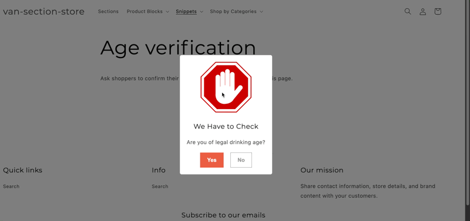

# Shopify Dawn Theme Extension - Age Verification

### Description:

    - A snippet which renders a popup modal for age verification.
    - Hide modal by adding a value to sessionStorage.getItem('age-verification') === 'true'
    - Modal will be closed when users click 'Yes', users will be redirected to homepage when clicking 'No'

## Installation

Copy and paste [age-verification.liquid](./snippets/age-verification.liquid/) into `snippets` folder in your Theme

## Usage


