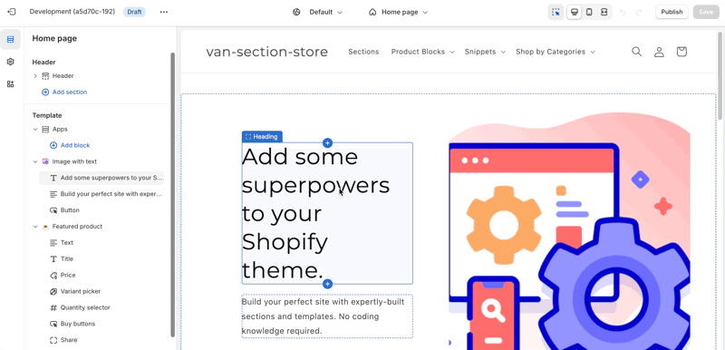

# Shopify Custom Theme Extension - Announcement Bar

### Description:

    - A custom announcement bar section
    - Append a button to close the announcement bar
    - addEventListener.click to button to hide bar by adding a class & adding a value to localStorage.setItem(isAnnouncementHiddenKey, true)
    - if localStorage value set, trigger a click to hide the bar on load

## Installation

Copy and paste [custom-announcement-bar.liquid](./sections/custom-announcement-bar.liquid/) into `sections` folder in your Theme

## Usage

1. Go to Theme editor > Add `Custom announcement bar` section to the Header
2. Hit 'Save'
3. Change the text, background color, text color as expected
