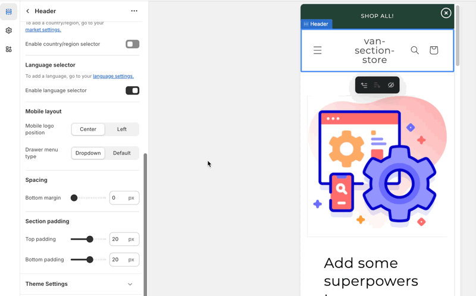

# Shopify Dawn Theme Extension - Header Drawer



### Description:

    - Add 'dropdown' styled menu to mobile header drawer of Dawn theme
    - Users can select between 'Default' and 'Dropdown' to show either default Dawn's mobile header menu or custom dropdown one

## Installation

1. Open `sections/header.liquid`

- Add this object to the `settings` of section schema
  ```liquid
  { "type": "select", "id": "drawer_type", "options": [ { "value":
  "drawer_dropdown", "label": "Dropdown" }, { "value": "drawer_default",
  "label": "Default" }, ], "default": "drawer_default", "label": "Drawer menu
  type", }
  ```
- Find this line of code

```liquid
if section.settings.menu != blank render 'header-drawer' endif
```

and replace by this:

`````liquid
if section.settings.menu != blank render 'header-drawer', drawer_type:
drawer_type endif ```

2. Open `snippets/header-drawer.liquid` delete all the code and replace by the
code in [header-drawer.liquid](./snippets/header-drawer.liquid/)

## Usage ````liquid 
`````
