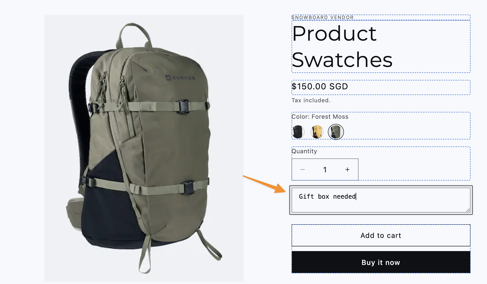

# Shopify Dawn Theme Extension - Product extra notes

- On front-end



- On back-end


### Description:

    - Add a custom product block to product tempplate
    - Users can leave an extra note to their orders
    - The extra notes will be added to backend in Orders

## Installation

1. Open `sections/main-product.liquid`

2. Add this object to the `blocks` of section schema

```json
    {
      "type": "extra_notes",
      "name": "Extra notes",
      "limit": 1
    },

```

3. Place this code inside the blocks forloop:

```liquid

  <textarea
    name="properties[Extra notes]"
    class="custom_product_notes"
    placeholder="Enter your notes here..."
    form="{{ product_form_id }}"
  ></textarea>
```

## Reference:

Refer to [main-product.liquid](./sections/main-product.liquid/)
