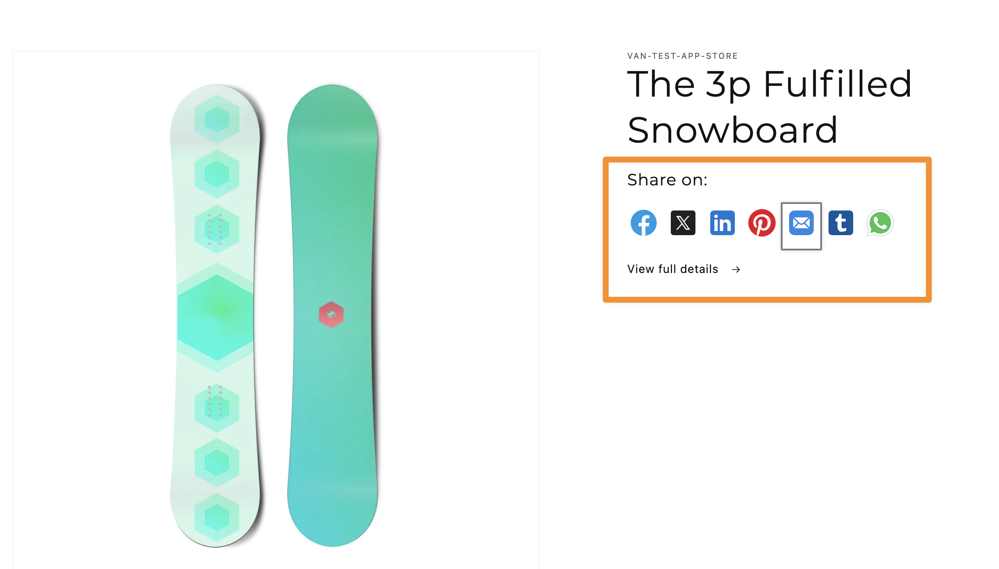

# Shopify Dawn Theme Extension - Share icons



### Description:

    - A snippet which renders multiple icons to share the link/images on social media platforms.
    - Use in `main-product.liquid`, `featured-product.liquid`, `main-article.liquid`

## Installation

Copy and paste [share-icons.liquid](./snippets/share-icons.liquid/) and [custom-social-icons.liquid](./snippets/custom-social-icons.liquid/) into `snippets` folder in your Theme

## Usage

1. `main-product.liquid`

- Open `sections/main-product.liquid`
- Find ``
- Replace the current snippet by this code:

```liquid

```

2. `main-article.liquid`

- Open `sections/main-article.liquid`
- Find ``
- Replace the current snippet by this code:

```liquid
<div
  class="article-template__social-sharing page-width page-width--narrow scroll-trigger animate--slide-in"
  {{ block.shopify_attributes }}
>
  
</div>
```

3. `featured-product.liquid`

- Open `sections/featured-product.liquid`
- Find ``
- Replace the current snippet by this code:

```liquid

```
